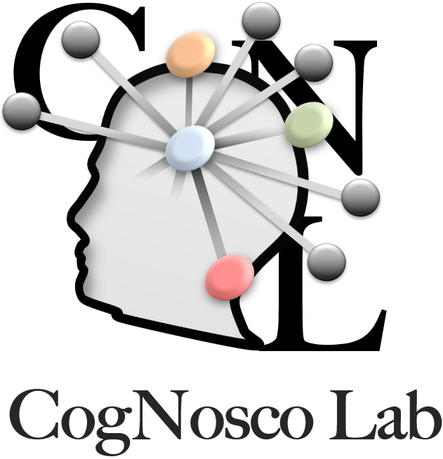
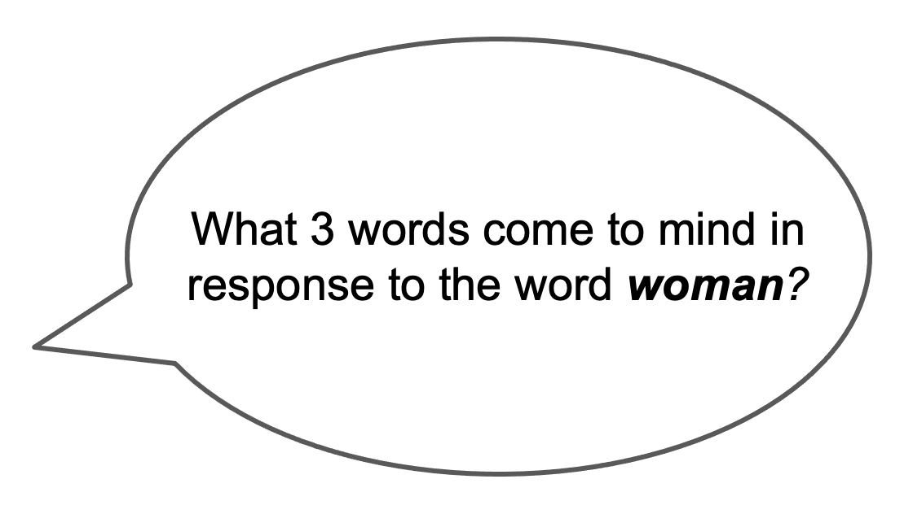
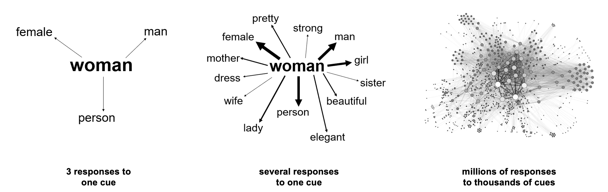
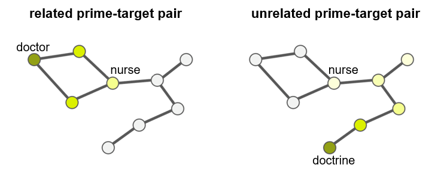
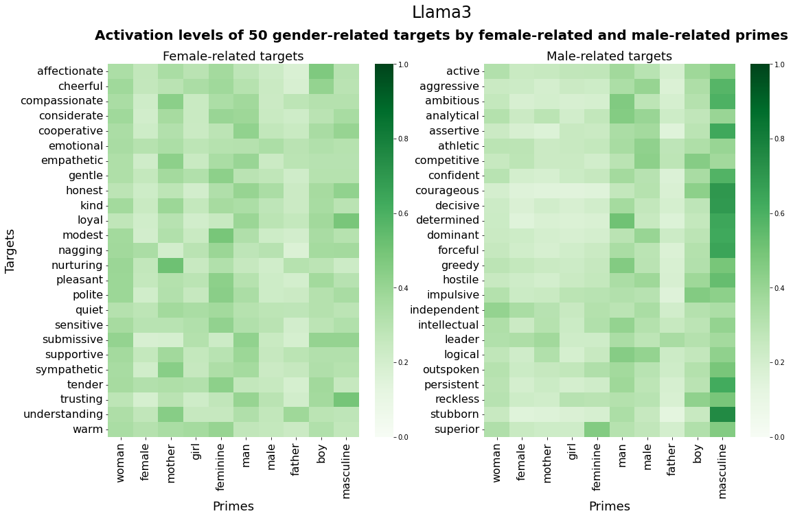

<div style="display: flex; justify-content: space-between; align-items: center;">
  
  
  
  
</div>

------

# LLM World Of Words (LWOW)
_Katherine Abramski_, _Riccardo Improta_, _Giulio Rossetti_, _Massimo Stella_

<p align="center">
  
</p>

The "LLM World of Words" (LWOW) is a collection of datasets of English free association norms generated by various large language models (LLMs). Currently, the collection consists of datasets generated by Mistral, LLaMA3, and Claude Haiku. The datasets are modeled after the [Small World of Words (SWOW)](https://smallworldofwords.org/en/project/) [3] English free association norms, generated by humans, consisting of over 12,000 cue words and over 3 million responses. The purpose of the LWOW datasets is to provide a way to investigate various aspects of the semantic memory of LLMs using an approach that has been applied extensively for investigating the semantic memory of humans. These datasets, together with the SWOW dataset, can be used to gain insights about similarities and differences in the language structures possessed by humans and LLMs.

-------

### What are free associations?
Free associations are implicit mental connections between words or concepts. They are typically accessed by presenting humans (or AI agents) with a cue word and then asking them to respond with the first words that come to mind. The responses represent implicit associations that connect different concepts in the mind, reflecting the semantic representations that underly patterns of thought, memory, and language. For example, given the cue word "woman", a common free association response might be "man", reflecting the associative mental relation between these two concepts.

<p align="center">
  

### How can they be used?
Free associations have been extensively used in cognitive psychology and linguistics as a tool for studying language and cognitive information processing. They provide a way for researchers to understand how conceptual knowledge is organized and accessed in the mind. Free associations are often used to built network models of semantic memory by connecting cue words to their responses, as shown in the figure below. When thousands of cues and responses are connected in this way, the result is a complex network model that represents the complex organization of semantic knowledge. Such models enable the investigation of complex cognitive processes that take place within semantic memory, and can be used to study a variety of cognitive phenomena such as language learning, creativity, personality traits, and cognitive biases.

<p align="center">
  

### Validation of the datasets with semantic priming

The LWOW datasets were validated using data from the [Semantic Priming Project](https://www.montana.edu/attmemlab/spp.html), which implements a lexical decision task (LDT) to study semantic priming. The semantic priming effect is the cognitive phenomenon that a target word (e.g. nurse) is more easily recognized when it is prompted by a related prime word (e.g. doctor) compared to an unrelated prime word (e.g. doctrine). We simulated the semantic priming effect within network models of semantic memory built from both the LWOW and the SWOW free association norms by implementing spreading activation processes within the networks. We found that the final activation levels of prime-target pairs correlated significantly with reaction time data for the same prime-target pairs from the LDT. Specifically, the activation of a target node (e.g. nurse) is higher when a related prime node (e.g. doctor) is activated compared to an unrelated prime node (e.g. doctrine). These results demonstrate how the LWOW datasets can be used for investigating cognitive and linguistic phenomena in LLMs, demonstrating the validity of the datasets.

<p align="center">
  

### Investigating gender biases
To demonstrate how this dataset can be used to investigate gender biases in LLMs compared to humans, we conducted an analysis using network models of semantic memory built from both the LWOW and the SWOW free association norms. We applied a methodology that simulates semantic priming within the networks to measure the strength of association between pairs of concepts, for example, "woman" and "forecful" vs. "man" and "forceful". We applied this methodology using a set of female-related and male-related primes, and a set of female-related and male-related targets. This analysis revealed that certain adjectives like "forceful" and "strong" are more strongly associated with certain genders, shedding light on the types of stereotypical gender biases that both humans and LLMs possess. Partial results of this analysis are shown in the heatmap below, which reflects the strength of assocation between pairs of words (primes and targets) within the Llama3 network.
<p align="center">
  


## Technical notes
The free associations were generated (either via API or locally, depending on the LLM) by providing each LLM with a set of cue words and the following prompt:

```
"Task:- You will be provided with an input word:
- Write the first 3 words you associate to it separated by a comma.
- No additional output text is allowed.
               
Constraints:
- no carriage return characters are allowed in the answers.
- answers should be as short as possible.
                           
Example:
Input: sea
Output: water,beach,sun"
```

This prompt was repeated 100 times for each cue word, resulting in a dataset of 11,545 unique cues words and 3,463,500 total responses for each LLM.

### Modification of the SWOW dataset to align with the LWOW datasets
In order to facilitate comparisons between humans and LLMs, we further processed the SWOW dataset to be aligned with the processing applied to the LWOW datasets. Due to the licensing of the original SWOW dataset, we do not provide this modified SWOW dataset in this repository, however this dataset, along with all subsequent analyses and output, can be reproduce by running the code as follows:


------

## Do you want to know more? Read the Preprint!

_Abramski, K., et al. (2024). The "LLM World of Words" English free association norms generated by large language models._

-----

# Further Information


### Funding & Legal

- SoBigData.it which receives funding from the European Union – NextGenerationEU – National Recovery and Resilience Plan (Piano Nazionale di Ripresa e Resilienza, PNRR) – Project: “SoBigData.it – Strengthening the Italian RI for Social Mining and Big Data Analytics” – Prot. IR0000013 – Avviso n. 3264 del 28/12/2021;
- EU NextGenerationEU programme under the funding schemes PNRR-PE-AI FAIR (Future Artificial Intelligence Research).
- The HumaneAI-Net project has received funding from the European Union’s Horizon 2020 research and innovation programme under grant agreement No 952026.
- COGNOSCO grant funded by Università di Trento (Grant ID: PS 22_27).

### Contacts

For speaking requests and enquiries, please contact:

Katherine Abramski : katherine.abramski@phd.unipi.it
Riccardo Improta : riccardo.improta@unitn.it
Giulio Rossetti : giulio.rossetti@isti.cnr.it 
Massimo Stella : massimo.stella-1@unitn.it 


### References

[1] _Abramski, K., et al. (2023). Cognitive network science reveals bias in gpt-3, gpt-3.5 turbo, and gpt-4 mirroring math anxiety in high-school students. Big Data and Cognitive Computing, 7(3), 124._

[2] _Abramski, K., et al. (2024). LLM-Generated Word Association Norms. In HHAI 2024: Hybrid Human AI Systems for the Social Good (pp. 3-12). IOS Press._

[3] _De Deyne, S., et al. (2019). The “Small World of Words” English word association norms for over 12,000 cue words. Behavior research methods, 51, 987-1006._ [Small World of Words Project](https://smallworldofwords.org/en/project/)

[4] _Hutchison, K. A. et al. (2013). The semantic priming project. Behavior research methods, 45, 1099-1114._ [Semantic Priming Project](https://www.montana.edu/attmemlab/spp.html)

[5] _Stella, M. (2019). Modelling early word acquisition through multiplex lexical networks and machine learning. Big Data and Cognitive Computing, 3(1), 10._

------

<div style="display: flex; justify-content: space-between; align-items: center;">
  
  
  
  
</div>
